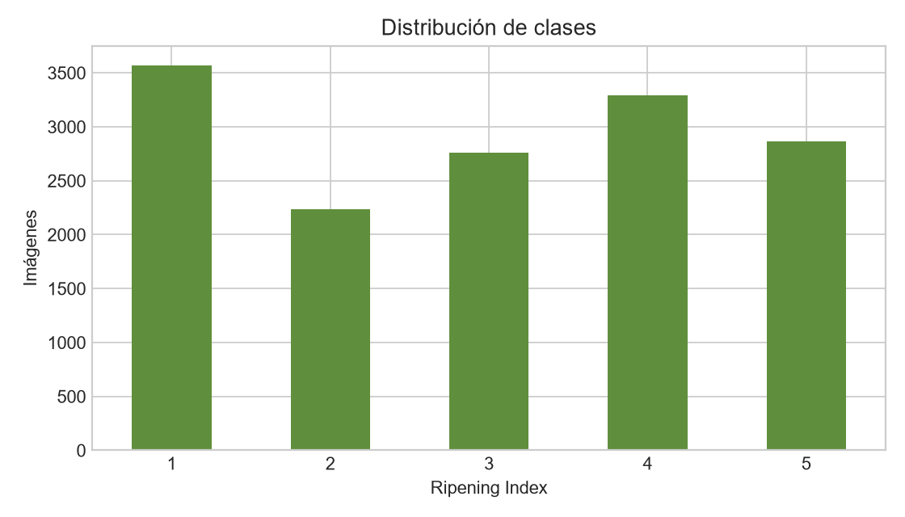
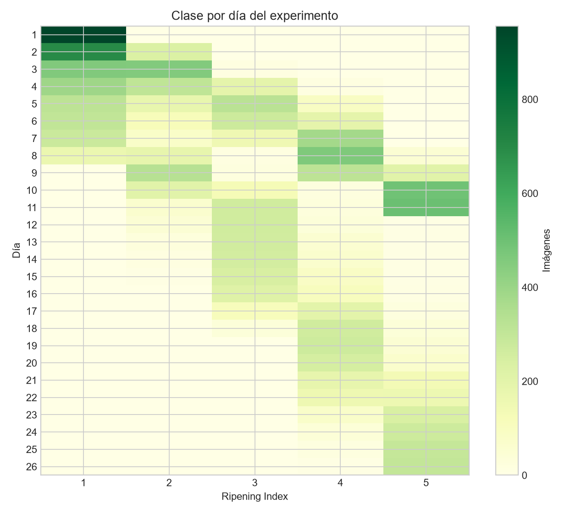
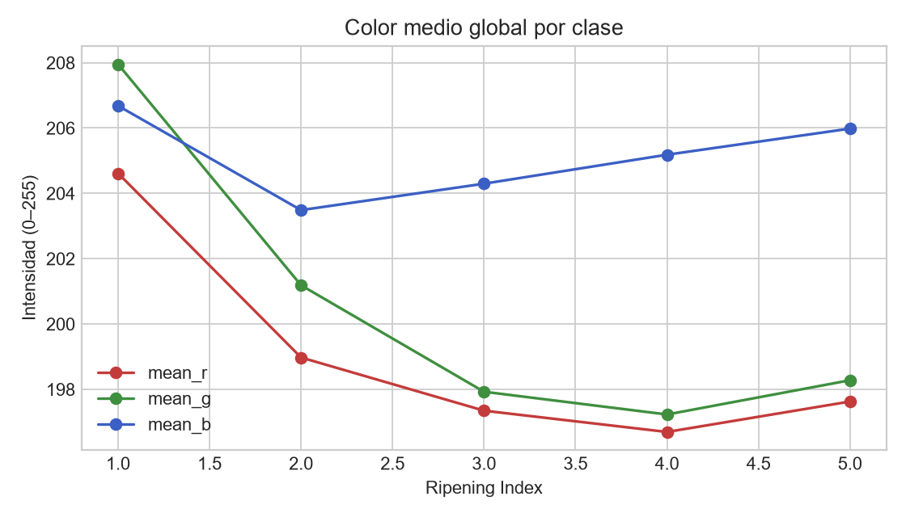
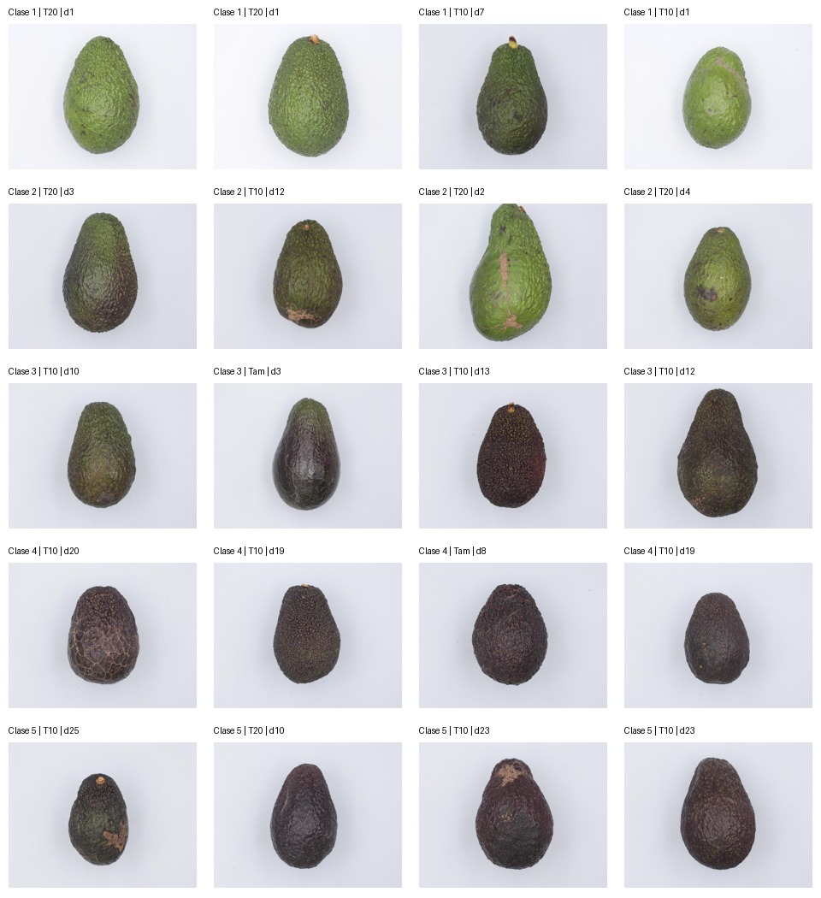

# EDA — Avocado Ripening Dataset

## Resumen

- Registros en Excel: **14,722**
- JPG encontrados: **14,710**
- Paltas distintas (unidad experimental): **478**
- Imágenes ausentes o inválidas: **12**
- Grupos de duplicados exactos: **0**
- Secuencias de madurez no monótonas: **0**

| Clase ordinal | Imágenes | Proporción |
|---:|---:|---:|
| 1 | 3572 | 24.26% |
| 2 | 2234 | 15.17% |
| 3 | 2758 | 18.73% |
| 4 | 3294 | 22.37% |
| 5 | 2864 | 19.45% |

## Hallazgos que afectan al modelado

1. **Fuga de etiqueta en el nombre.** El último componente del archivo coincide con
   `Ripening Index Classification`. `file_stem`, `image_path` y `filename_label` son
   variables administrativas y nunca deben entrar al modelo.
2. **Mediciones repetidas.** Cada palta aparece en varios días y tiene dos vistas
   (`a` y `b`). Los splits deben hacerse por `sample_id`, no por imagen; ambas vistas
   y todos los días de una palta deben permanecer en un solo split.
3. **El día es un proxy fuerte del objetivo.** La madurez avanza de manera ordinal y
   no se observaron retrocesos de clase por palta. Para evaluar visión, `day` tampoco
   debe ser una entrada del modelo.
4. **Desbalance moderado.** La clase mayoritaria es 1 y la minoritaria es 2. Conviene
   reportar macro-F1, balanced accuracy y matriz de confusión, además de accuracy.
5. **Objetivo ordinal.** Confundir 1 con 2 no tiene el mismo costo que confundir 1 con
   5. Además de métricas nominales, conviene medir MAE de clase y quadratic weighted
   kappa.
6. **Fondo dominante.** Todas las imágenes tienen fondo claro y el promedio RGB global
   queda dominado por ese fondo. En el siguiente paso conviene medir color y textura
   sobre una máscara de la palta y usar augmentations que impidan aprender el fondo.

## Integridad

Imágenes referenciadas pero ausentes (12): `T10_d02_072_a_1.jpg`, `T10_d02_072_b_1.jpg`, `T10_d04_065_a_3.jpg`, `T10_d04_065_b_3.jpg`, `T20_d02_141_a_2.jpg`, `T20_d02_141_b_2.jpg`, `T20_d03_192_a_1.jpg`, `T20_d03_192_b_1.jpg`, `T20_d03_212_a_2.jpg`, `T20_d03_212_b_2.jpg`, `Tam_d02_052_a_2.jpg`, `Tam_d02_052_b_2.jpg`

Los detalles por archivo están en `manifest.csv` y los valores agregados en
`summary.json`.

## Gráficos

